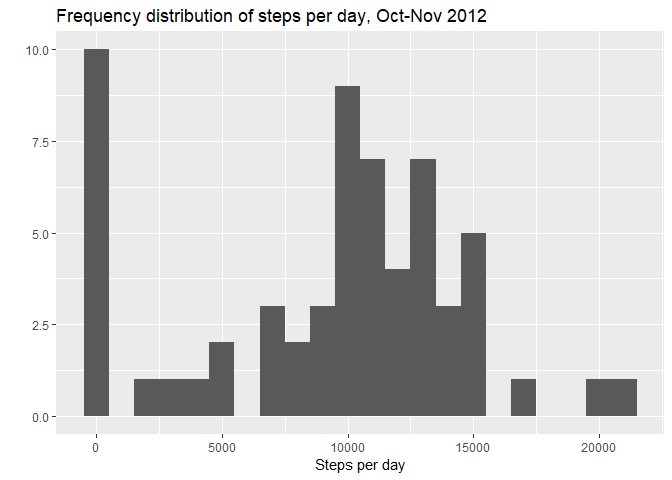
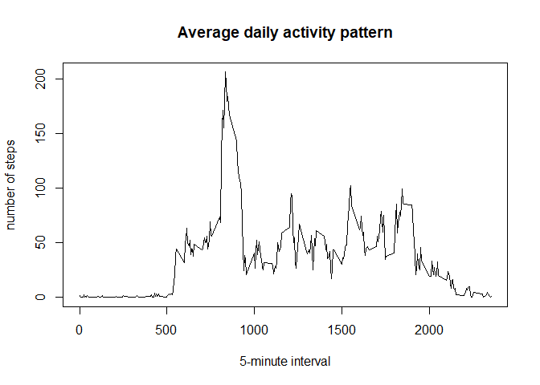
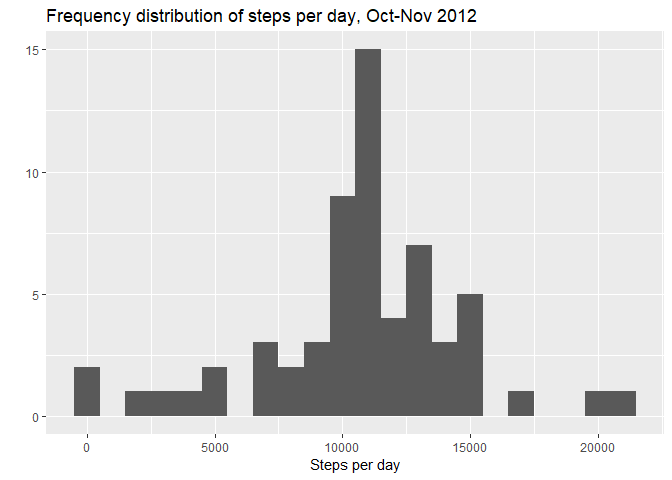
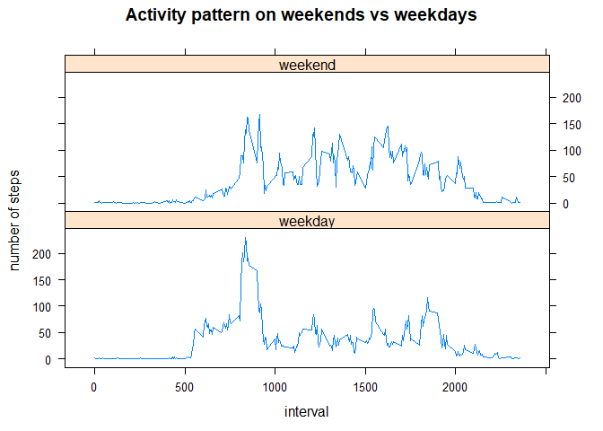

## Loading and preprocessing the data


```r
fileURL <- 'https://d396qusza40orc.cloudfront.net/repdata%2Fdata%2Factivity.zip'
download.file(fileURL, destfile = 'Activity.zip')
unzip('Activity.zip')
Activity <- read.csv('Activity.csv')
```

## What is the mean total number of steps taken per day?

First, we sum the step count for each day. Then we plot a histogram of the amount of steps taken each day using ggplot2.


```r
stepsdaily <- with (Activity, tapply(steps,date,sum, na.rm = T))
library(ggplot2)
qplot(stepsdaily, geom = 'histogram', binwidth = 1000) + labs(x = 
'Steps per day', title = 'Frequency distribution of steps per day, Oct-Nov 2012')
```

<!-- -->

We then proceed to calculate the mean and median of the total number of steps taken per day


```r
mean(stepsdaily)
```

```
## [1] 9354.23
```

```r
median(stepsdaily)
```

```
## [1] 10395
```

## What is the average daily activity pattern?

First, we calculate the average number of steps taken for each 5 minute interval. We then plot a time series of this data.


```r
stepsperinterval <- with(Activity, tapply(steps, interval, mean, na.rm = T))
plot(names(stepsperinterval), stepsperinterval, type = 'l', xlab = 
'5-minute interval', ylab = 'number of steps', main = 'Average daily activity pattern')
```

<!-- -->

Next, we show which 5-minute interval, on average across all the days in the dataset, contains the maximum number of steps. It turns out it's interval 835 with an average number of steps of 206.1698.


```r
stepsperinterval[which.max(stepsperinterval)]
```

```
##      835 
## 206.1698
```

##Imputing missing values

We calculate the total number of missing values in the dataset:


```r
sum(is.na(Activity))
```

```
## [1] 2304
```

In case a value is missing, we impute the missing values by taking the mean for that 5-minute interval in the entire dataset. We create an object called ActivityImputed to store the dataset with imputed values.


```r
ActivityImputed <- Activity
for(i in 1:nrow(ActivityImputed)) {
  if (is.na(ActivityImputed[i,1])) {
    ActivityImputed[i,1] <- subset(stepsperinterval, names(stepsperinterval) == 
                            ActivityImputed[i,3])
  }
}
```

Next, we once again make a histogram of the total number of steps taken each day, but this time for the dataset with imputed values. We also calculate the mean and median total number of steps taken each day for the dataset with imputed values.


```r
stepsdailyImputed <- with (ActivityImputed, tapply(steps,date,sum))
qplot(stepsdailyImputed, geom = 'histogram', binwidth = 1000) + labs(x = 
'Steps per day', title = 'Frequency distribution of steps per day, Oct-Nov 2012')
```

<!-- -->

```r
mean(stepsdailyImputed)
```

```
## [1] 10766.19
```

```r
median(stepsdailyImputed)
```

```
## [1] 10766.19
```

If we compare the histogram to the one we created earlier, the most important change is that there are far fewer days with near zero steps, and those days are mostly added to the centre of the distribution. This is to be expected, since NA values count as zero when adding up the steps. If we look at the mean and the median values the first thing that catches the eye is that incredibly, both values are the same. Furthermore we note that both figures are somewhat higher than the ones we saw before, especially the mean. Again, this is to be expected since imputing missing values increases the step count on days where there used to be NA values.

##Are there differences in activity patterns between weekdays and weekends?

Since the values in the date column of the Activity dataframe are considered to be factors by R, we first need to convert this column to class date. Next, we add a column weekday to the dataframe, which tells us on which day of the week the measurement was taken. Lastly, the column daytype indicates if the measurement was taken on a weekday or on a weekend.


```r
ActivityImputed$date <- as.Date(ActivityImputed$date, '%Y-%m-%d')
ActivityImputed$weekday <- weekdays(ActivityImputed$date, abbreviate = T)
ActivityImputed$daytype <- ifelse(ActivityImputed$weekday == 'Sat' | ActivityImputed$weekday == 'Sun', 'weekend', 'weekday')
```

Having done this, we recreate the stepsperinterval variable we saw earlier, but this time we create separate ones for weekdays and weekends. We then combine them into one dataframe (spi), and reshape the dataframe so that each row contains one observation of either a weekday or weekend value. The operation requires the melt function which is part of the reshape2 package.

```r
weekday <- with(ActivityImputed[ActivityImputed$daytype == 'weekday',], tapply(steps, interval, mean))
weekend <- with(ActivityImputed[ActivityImputed$daytype == 'weekend',], tapply(steps, interval, mean))
spi <- cbind(weekday,weekend)
library(reshape2)
spi <- melt(spi)
colnames(spi) <- c('interval', 'daytype', 'steps')
```

Lastly, we plot the data in a panel plot using the lattice package which shows the difference in activity pattern between weekdays and weekends.


```r
library(lattice)
xyplot(steps ~ interval | daytype, data = spi, type = 'l', layout = c(1,2), main =
         'Activity pattern on weekends vs weekdays', ylab = 'number of steps')
```

<!-- -->
